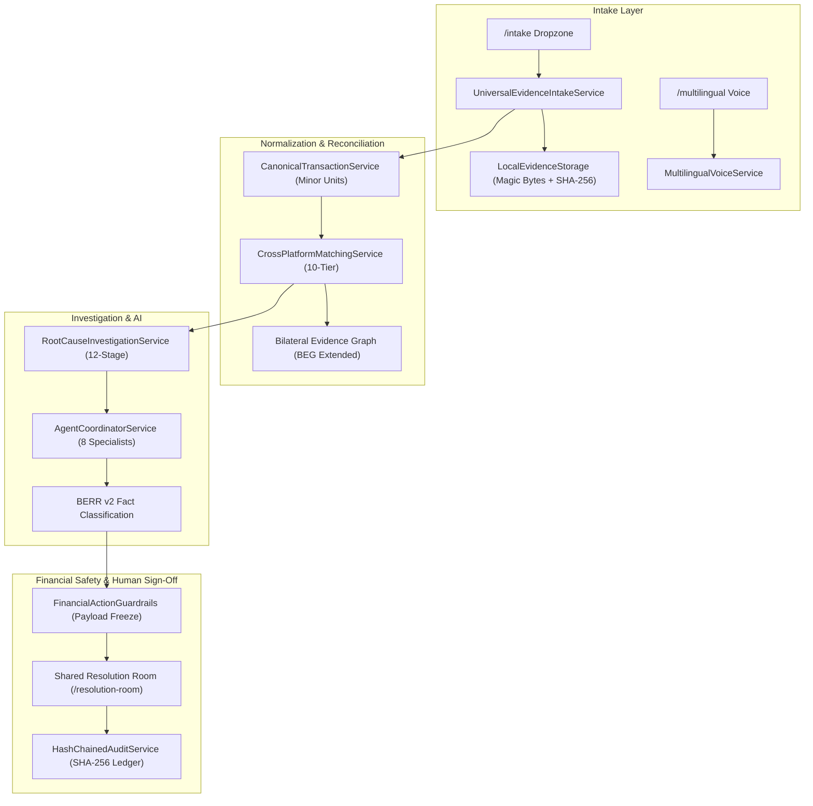

# REPORT 10 — MODULE DEPENDENCY MATRIX

## 1. System Topology & Data Flow

```mermaid
flowchart TD
    subgraph Intake Layer
        UI_Intake["/intake Dropzone"] --> IntakeService["UniversalEvidenceIntakeService"]
        Voice_Intake["/multilingual Voice"] --> VoiceService["MultilingualVoiceService"]
        Storage["LocalEvidenceStorage (Magic Bytes + SHA-256)"]
        IntakeService --> Storage
    end

    subgraph Normalization & Reconciliation
        IntakeService --> CanonicalEngine["CanonicalTransactionService (Minor Units)"]
        CanonicalEngine --> MatchingEngine["CrossPlatformMatchingService (10-Tier)"]
        MatchingEngine --> BEG["Bilateral Evidence Graph (BEG Extended)"]
    end

    subgraph Investigation & AI
        MatchingEngine --> RootCause["RootCauseInvestigationService (12-Stage)"]
        RootCause --> AgentCoord["AgentCoordinatorService (8 Specialists)"]
        AgentCoord --> BERR["BERR v2 Fact Classification"]
    end

    subgraph Financial Safety & Human Sign-Off
        BERR --> Guardrails["FinancialActionGuardrails (Payload Freeze)"]
        Guardrails --> Room["Shared Resolution Room (/resolution-room)"]
        Room --> Audit["HashChainedAuditService (SHA-256 Ledger)"]
    end
```
